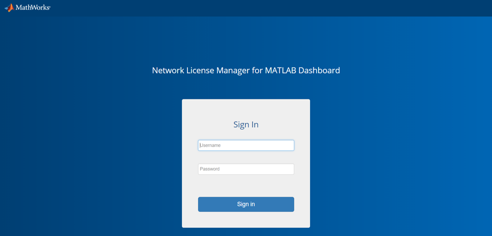
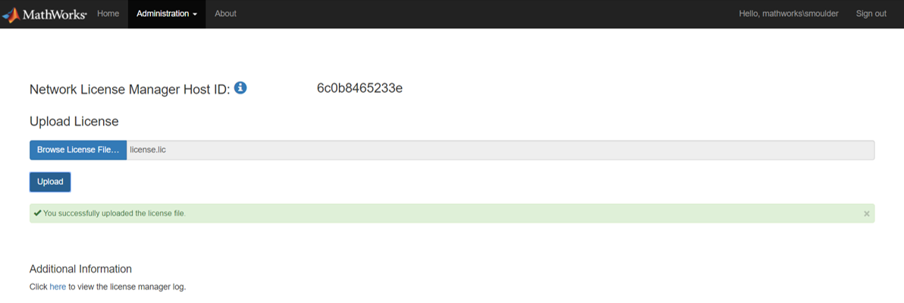
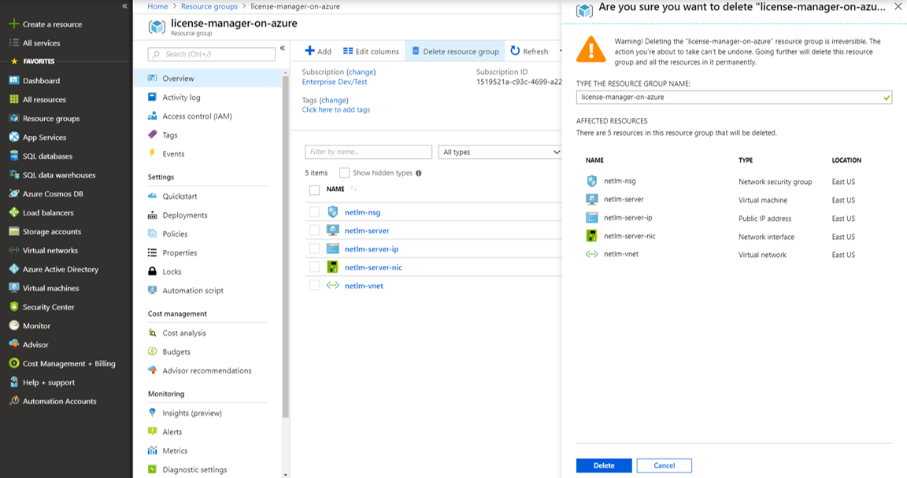

# Network License Manager for MATLAB on Microsoft Azure

# Requirements

Before starting, you will need the following:

- An Azure™ account.

- A valid MathWorks license. For more information on how to configure your license for cloud use, see [MATLAB Parallel Server on the Cloud](https://www.mathworks.com/help/licensingoncloud/matlab-parallel-server-on-the-cloud.html).

# Costs
You are responsible for the cost of the Azure services used when you create cloud resources using this guide. Resource settings, such as instance type, will affect the cost of deployment. For cost estimates, see the pricing pages for each Azure service you will be using. Prices are subject to change.

# Introduction
The following guide will help you automate the process of launching a Network License Manager for MATLAB on Azure using your Azure account. The cloud resources are created using Azure Resource Manager (ARM) templates. For information about the architecture of this solution, see [Learn About Network License Manager for MATLAB Architecture](#learn-about-network-license-manager-for-matlab-architecture).

# Deployment Steps

## Step 1. Launch the Template

Click the **Deploy to Azure** button below to deploy the cloud resources on Azure. This will open the Azure Portal in your web browser.

> Server Platform: Windows Server 2016

> Network license manager for MATLAB Release: R2019a

## Step 2. Configure the Cloud Resources
Clicking the Deploy to Azure button opens the "Custom deployment" page in your browser. You can configure the parameters on this page. It is easier to complete the steps if you position these instructions and the Azure Portal window side by side.

1. Specify and check the defaults for these resource parameters:

    | Parameter label                            | Description
    | ------------------------------------------ | -----------
    | **Subscription**                           | Choose an Azure subscription to use for purchasing resources.
    | **Resource group**                         | Choose a name for the resource group that will hold the resources. It is recommended to create a new resource group for each deployment. This allows all resources to be deleted simultaneously.
    | **Location**                               | Choose the region to start resources in. Ensure that you select a location which supports your requested instance types. To check which services are supported in each location, see [Products available by region](https://azure.microsoft.com/en-gb/regions/services/).
    | **Instance Type**                          | Choose the Azure instance type to use for the license server. The selected [virtual machine size](https://docs.microsoft.com/en-us/azure/virtual-machines/windows/sizes) must support premium storage.
    | **Client IP Address**                      | This is the IP address range that will be allowed to access the resources. The format for this field is IP Address/Mask. 
<em>Example</em>: 
10.0.0.1/32 <ul><li>This is the public IP address which can be found by searching for "what is my ip address" on the web. The mask determines the number of IP addresses to include.</li><li>A mask of 32 is a single IP address.</li><li>Use a [CIDR calculator](https://www.ipaddressguide.com/cidr) if you need a range of more than one IP addresses.</li><li>You may need to contact your IT administrator to determine which address is appropriate.</li></ul>

    | **Admin Username**                         | Enter a username you would like to use to connect to the network license manager for MATLAB Dashboard.
    | **Admin Password**                         | Enter a password you would like to use to connect to the network license manager for MATLAB Dashboard.

2. Tick the box to accept the Azure Marketplace terms and conditions.

3. Click the **Purchase** button.

When you click the **Purchase** button, the resources are created using Azure template deployments. Template deployment can take several minutes.

# Step 3: Connect to the Dashboard
> **Note**: The Internet Explorer web browser is not supported for interacting with the dashboard.

1. In the Deployments for your resource group, select the Microsoft.Template deployment created in step 2 and select the **Outputs** section.
2. Copy the URL listed in the `NETWORKLICENSEMANAGERADDRESS` field. This is the HTTPS endpoint to the network license manager for MATLAB Dashboard.

# Step 4: Sign in to the Dashboard
1. Paste the network license manager Address URL into a web browser.
2. At the sign in screen, enter the username and password you created in Step 2.

    

> **Note**: The dashboard uses a self-signed certificate which can be changed. For information on changing the self-signed certificates, see [Change Self-signed Certificate](#change-self-signed-certificate).

# Step 5: Upload the License File
> **Note**: You will need the fixed network license manager Host ID to get a license file from the MathWorks License Center for your product. For more information, see the documentation for your product.

1. In the dashboard, go to **Administration > Manage License**.
2. Click **Browse License File** to select the license file you want to upload and click **Open**.
3. Click **Upload**.

    

You are now ready to use the network license manager on Azure.

To configure your MATLAB products deployed in Azure to use the network license manager, see the product documentation. An example for MATLAB Parallel Server can be found at [MATLAB Parallel Server on Azure](https://github.com/mathworks-ref-arch/matlab-parallel-server-on-azure).

# Additional Information
## Delete Your Cloud Resources
You can remove the Resource Group and all associated resources when you are done with them. Note that you cannot recover resources once they are deleted.
1. Sign in to the Azure Portal.
2. Select the Resource Group containing your resources.
3. Select the "Delete resource group" icon to destroy all resources deplyoyed in this group.
4. You will be prompted to enter the name of the resource group to confirm the deletion.

    

## Change Self-signed Certificate
You can change the self-signed certificate used to connect to the dashboard. To upload an HTTPS certificate:
1. On the dashboard navigation menu, select **Administration** > **Manage HTTPS Certificate**.
1. Click **Browse Certificate...** and select a certificate file. Only `.pfx` files are supported.
1. Enter the certificate password in the **Certificate Password** field.
1. Click **Upload**.

The server will automatically restart after uploading a certificate. You will need to sign out and sign back in.

## Troubleshooting
If your resource group fails to deploy, check the Deployments section of the Resource Group. It will indicate which resource deployments failed and allow you to navigate to the relevant error message.

## Use Existing Virtual Network
You can launch the reference architecture within an existing virtual network and subnet using the azuredeploy-existing-vnet.json template.

> Server Platform: Windows Server 2016

> MATLAB Release: R2019a

This template requires the following two additional parameters:

| Parameter label                           | Description
| ----------------------------------------- | -----------
| **Virtual Network Resource ID**           | The Resource ID of an existing virtual network to deploy your server into. You can find this under the Properties of your virtual network.
| **Subnet Name**                           | The name of an existing subnet within your virtual network to deploy your server into.

## Learn About Network License Manager for MATLAB Architecture

The network license manager and the resources required by it are created using [Azure Resource Manager templates](https://docs.microsoft.com/en-gb/azure/azure-resource-manager/resource-group-overview). The architecture of the server resources created by the template is illustrated in Figure 2. For more information about each resource, see the [Azure template reference.](https://docs.microsoft.com/en-us/azure/templates/)

*Figure 2: Network License Manager Architecture*

The following resources are created.

### Networking resources
* Virtual Network (Microsoft.Network/virtualNetworks) The Virtual Network includes the following components:
    * Subnet (Microsoft.Network/virtualNetworks/subnets)
    * Network Security Group (Microsoft.Network/networkSecurityGroups) : Ingress rules from client IP address:
        * Allow 3389: Required for Remote Desktop Protocol to the cluster nodes.
        * Allow 443: Required for communication between client and network license manager for MATLAB Dashboard server.
        * Allow 27000-27001: Required for communication from MATLAB and MATLAB workers to the network license manager for MATLAB.
        * Allow all internal traffic: Open access to network traffic between all cluster nodes internally.
* Network interface (Microsoft.Network/networkInterfaces)
* Public IP Address (Microsoft.Network/publicIPAddresses)

### Instances
* Network license manager instance (Microsoft.Compute/virtualMachines): A Compute instance for the license server.
  * Custom Script Extension (Microsoft.Compute/virtualMachines/extensions): An extension which configures this instance at deployment time to start the network license manager for MATLAB Dashboard web server.

# Enhancement Request
Provide suggestions for additional features or capabilities using the following link: [https://www.mathworks.com/cloud/enhancement-request.html](https://www.mathworks.com/cloud/enhancement-request.html)

# Technical Support
Email: `cloud-support@mathworks.com`
