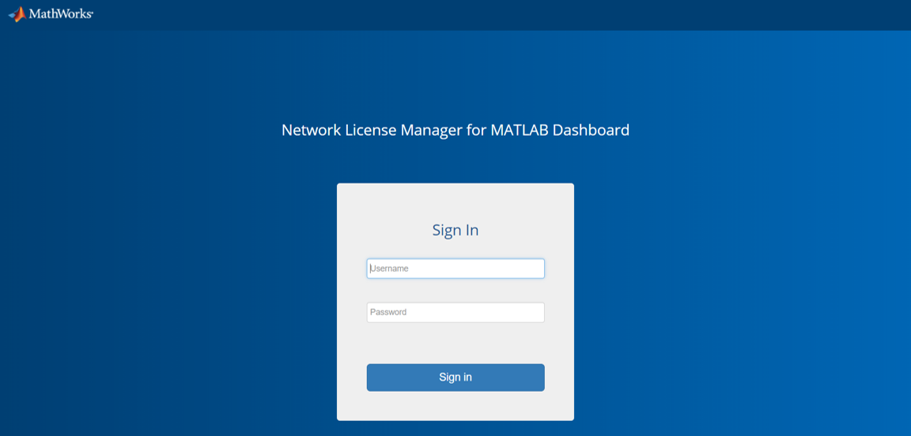
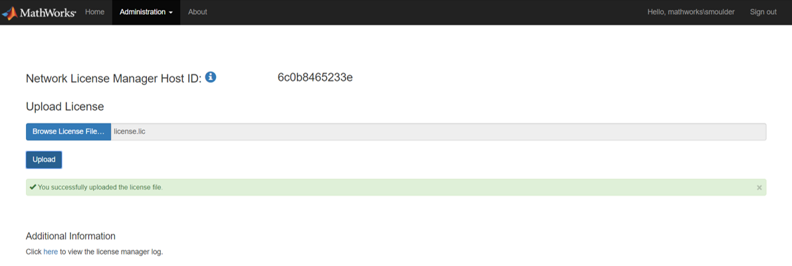
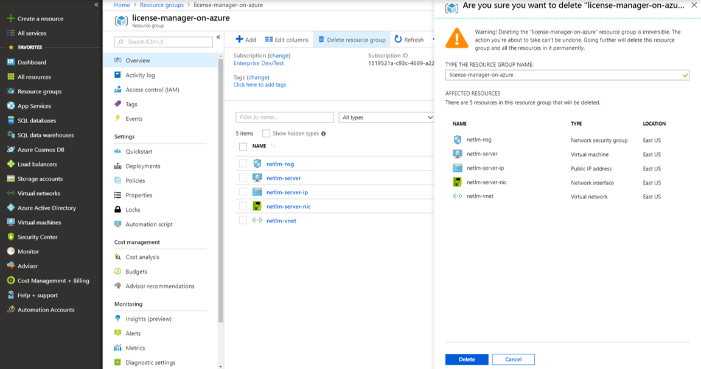

# Network License Manager for MATLAB on Microsoft Azure

## Step 1. Launch the Template

Click the **Deploy to Azure** button below to deploy the cloud resources on Azure. This will open the Azure Portal in your web browser.

| Create Virtual network | Use Existing Virtual Network |
| --- | --- |
| Use this option if you would like to deploy the resources in a new virtual network:     | Use this option if you would like to deploy the resources in an existing virtual network:      |

> Cluster Platform: Windows Server 2019

> MATLAB Release: R2022a

## Step 2. Configure the Cloud Resources
Clicking the Deploy to Azure button opens the "Custom deployment" page in your browser. You can configure the parameters on this page. It is easier to complete the steps if you position these instructions and the Azure Portal window side by side.

1. Specify and check the defaults for these resource parameters:

| Parameter label | Description |
| --------------- | ----------- |
| **Instance Type** | Azure instance type, see https://docs.microsoft.com/en-us/azure/virtual-machines/windows/sizes. |
| **Client IP Address** | The IP address range that can be used access the license manager. This must be a valid IP CIDR range of the form x.x.x.x/x. Use the value &lt;your_public_ip_address&gt;/32 to restrict access to only your computer. |
| **Admin Password** | Admin password for user 'manager'. This is used to login to the Network License Manager for MATLAB dashboard. |
| **Virtual Network Resource ID** | The Resource ID of an existing virtual network to deploy your server into. Specify this parameter only when deploying with the Existing Virtual Network option. Specify this parameter only when deploying with the Existing Virtual Network option. |
| **Subnet Name** | The name of an existing subnet within your virtual network to deploy your server into. Specify this parameter only when deploying with the Existing Virtual Network option. Specify this parameter only when deploying with the Existing Virtual Network option. |

**NOTE**: The port and hostname of the network license manager must be reachable from all virtual machines running MATLAB. It is therefore recommended that you deploy into a subnet within the same virtual network as the network license manager.

2. Tick the box to accept the Azure Marketplace terms and conditions.

3. Click the **Create** button.

# Step 3: Connect to the Dashboard

> **Note**: The Internet Explorer web browser is not supported for interacting with the dashboard.

1. In the Deployments for your resource group, select the Microsoft.Template deployment created in step 2 and select the **Outputs** section.
2. Copy the URL listed in the `NETWORKLICENSEMANAGERADDRESS` field. This is the HTTPS endpoint to the network license manager for MATLAB Dashboard.

# Step 4: Sign in to the Dashboard
1. Paste the network license manager Address URL into a web browser.
2. Enter the username `manager` along with the password for this user you created in Step 2.

    

> **Note**: The dashboard uses a self-signed certificate which can be changed. For information on changing the self-signed certificates, see [Change Self-signed Certificate](#change-self-signed-certificate).

# Step 5: Upload the License File
> **Note**: You will need the fixed network license manager Host ID to get a license file from the MathWorks License Center for your product. For more information, see the documentation for your product.

1. In the dashboard, go to **Administration > Manage License**.
2. Click **Browse License File** to select the license file you want to upload and click **Open**.
3. Click **Upload**.

    

You are now ready to use the network license manager on Azure.

To configure your MATLAB products deployed in Azure to use the network license manager, see the product documentation. An example for MATLAB Parallel Server can be found at [MATLAB Parallel Server on Azure](https://github.com/mathworks-ref-arch/matlab-parallel-server-on-azure).

# Additional Information
## Delete Your Cloud Resources
You can remove the Resource Group and all associated resources when you are done with them. Note that you cannot recover resources once they are deleted.
1. Sign in to the Azure Portal.
2. Select the Resource Group containing your resources.
3. Select the "Delete resource group" icon to destroy all resources deplyoyed in this group.
4. You will be prompted to enter the name of the resource group to confirm the deletion.

    

## Change Self-signed Certificate
You can change the self-signed certificate used to connect to the dashboard. To upload an HTTPS certificate:
1. On the dashboard navigation menu, select **Administration** > **Manage HTTPS Certificate**.
1. Click **Browse Certificate...** and select a certificate file. Only `.pfx` files are supported.
1. Enter the certificate password in the **Certificate Password** field.
1. Click **Upload**.

The server will automatically restart after uploading a certificate. You will need to sign out and sign back in.

## Troubleshooting
If your resource group fails to deploy, check the Deployments section of the Resource Group. It will indicate which resource deployments failed and allow you to navigate to the relevant error message.